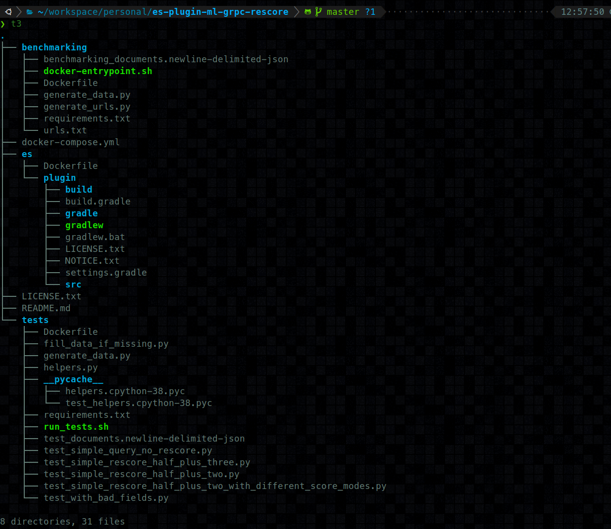

## Getting Started

----

The purpose of this document is meant to be the 0-60 approach. Reading this document will tell you briefly how the
project is structured, and what interesting parts there are. My goal is to help you understand how to view this project.

### Structure

---

Regarding the project structure, things are maybe a bit different here than you are used to. 
I think in modern web development we're seeing the rise of the container as the new "unit". 
With that in mind this project is divided into a few discrete units that are designed to help
you think about which part you're working on.

Chances are by the time you're reading this, this will document will be out of date. But what will
not be changing is how I think about this project. That should remain consistent. At the top level
of the project, at the time of writing this the structure looks like this:



In this example we generally have three things to notice.

1. `es` directory contains a `Dockerfile`
2. `test` directory contains a `Dockerfile`
3. `benchmarking` directory contains a `Dockerfile`

Also there is a `docker-compose.yml` at the root of the project.

We can utilize any of the given containers in any order we feel like. 
But we need to appreciate that in order for the plugin to actually work 